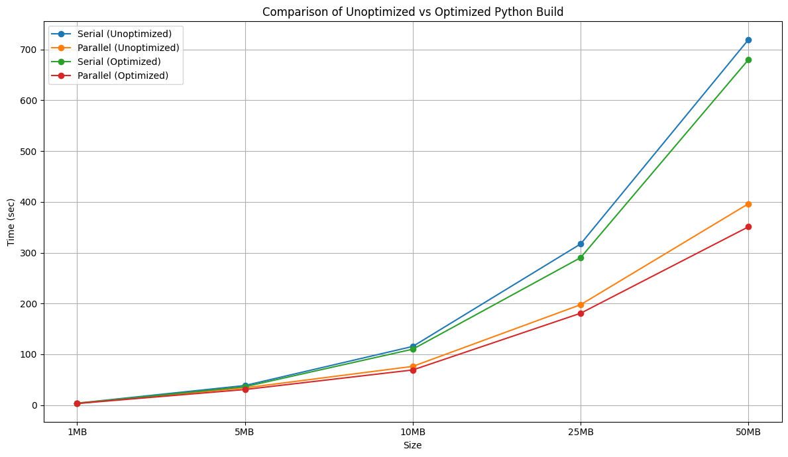

| Size | Serial (sec) | Parallel (sec) |
|------|--------------|----------------|
| 1MB  | 3.72         | 3.68           |
| 5MB  | 38.47        | 33.85          |
| 10MB | 115.43       | 76.17          |
| 25MB | 317.20       | 197.62         |
| 50MB | 719.52       | 396.39         |

Я попробовал собрать сборку с оптимизациями бинарника и получил такой результат:

| Size | Serial (sec) | Parallel (sec) |
|------|--------------|----------------|
| 1MB  | 3.09         | 3.04           |
| 5MB  | 36.1         | 30.6           |
| 10MB | 110.01       | 69.12          |
| 25MB | 290.23       | 180.77         |
| 50MB | 680.09       | 350.96         |

Сравнение двух сборок:

В общем получили доп прирост +- 10% 